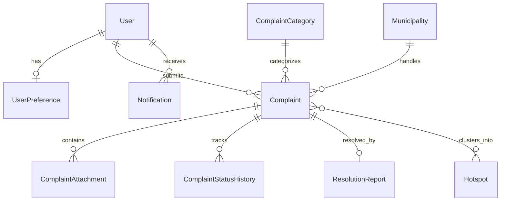
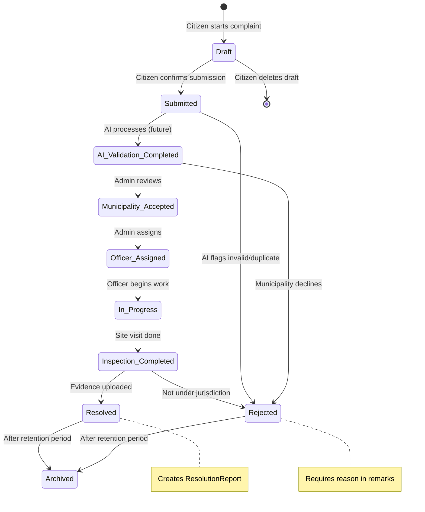

# CleaniSense — Backend Implementation Plan

**Version:** 1.1
**Last Updated:** 2026-07-07
**Status:** Approved — Completed

> [!NOTE]
> As of recent updates, Alembic migrations have been removed to simplify schema initialization. The database schema is now initialized directly from SQLAlchemy metadata using `Base.metadata.create_all(bind=engine)` inside `backend/app/main.py`.

> This document is the **single source of truth** for CleaniSense backend development.
> Written for handoff to senior backend engineers building a production-ready government civic platform.

---

## Table of Contents

1. [Project Overview](#1-project-overview)
2. [Technology Stack](#2-technology-stack)
3. [Architectural Principles](#3-architectural-principles)
4. [Folder Structure](#4-folder-structure)
5. [Existing Foundation](#5-existing-foundation)
6. [Role Hierarchy](#6-role-hierarchy)
7. [Constants & Enums](#7-constants--enums)
8. [Database Models](#8-database-models)
9. [API Endpoint Specification](#9-api-endpoint-specification)
10. [Complaint Lifecycle State Machine](#10-complaint-lifecycle-state-machine)
11. [Notification Dispatch Rules](#11-notification-dispatch-rules)
12. [File Storage Module](#12-file-storage-module)
13. [Standard API Response Format](#13-standard-api-response-format)
14. [Service Layer Responsibilities](#14-service-layer-responsibilities)
15. [Middleware Layer](#15-middleware-layer)
16. [Validation Rules](#16-validation-rules)
17. [Security Rules](#17-security-rules)
18. [Authentication & Request Lifecycle](#18-authentication--request-lifecycle)
19. [Config Additions](#19-config-additions)
20. [Dependencies](#20-dependencies)
21. [Mock Server Strategy](#21-mock-server-strategy-future)
22. [Implementation Order](#22-implementation-order)
23. [Future Module Reservations](#23-future-module-reservations)

---

## 1. Project Overview

CleaniSense is an AI-powered environmental reporting platform enabling citizens to report pollution and environmental issues while helping municipalities verify, prioritize, resolve, and transparently communicate actions taken.

**Primary Workflow:**
```
Citizen → Report Issue → AI Validation (future) → Priority & Severity Analysis
    → Municipality Review → Resolution → Citizen Verification
```

The backend is designed for **long-term scalability**, but initial implementation focuses on the **Citizen Module** only.

---

## 2. Technology Stack

| Layer | Technology |
|---|---|
| **Framework** | FastAPI |
| **Database** | PostgreSQL (SQLite for local dev) |
| **ORM** | SQLAlchemy 2.0 (mapped columns) |
| **Migrations** | Alembic |
| **Validation** | Pydantic v2 |
| **Auth** | Firebase Authentication (ID token verification only — no backend-issued JWT) |
| **Object Storage** | Firebase Storage (complaint images, resolution evidence, attachments) |
| **Language** | Python 3.11+ |

---

## 3. Architectural Principles

```
┌─────────────┐     ┌───────────────┐     ┌──────────────┐     ┌──────────────┐
│  API Layer  │ ──► │ Service Layer │ ──► │  Repository  │ ──► │   Database   │
│  (Routers)  │     │ (Business)    │     │  (Data)      │     │ (PostgreSQL) │
└─────────────┘     └───────┬───────┘     └──────────────┘     └──────────────┘
       │                    │
  Pydantic Schemas    Firebase Admin SDK
  (Request/Response)  Storage Service
```

### Rules

- **No business logic** inside API routes. Routes only parse, delegate, and format responses.
- **No database logic** inside services. Services call repositories only.
- **Repository layer** only communicates with the database. One repository per model.
- Every service has a **single responsibility**.
- Modules are **independent** — no circular imports between modules.
- **Dependency injection** via FastAPI `Depends()`.
- All enums, status codes, and role constants live in `constants/enums.py` — never as scattered string literals.
- Design for **maintainability** over shortcuts.

---

## 4. Folder Structure

```
backend/
├── alembic/                            # Database migration scripts
│   ├── versions/                       # Individual migration files
│   ├── env.py
│   └── alembic.ini
│
├── app/
│   ├── __init__.py
│   ├── main.py                         # FastAPI bootstrap, middleware registration
│   │
│   ├── api/                            # API Layer — HTTP request handling
│   │   ├── deps.py                     # Shared dependencies (get_db, get_current_user, RoleChecker)
│   │   └── v1/
│   │       ├── __init__.py             # Router aggregator
│   │       └── routers/
│   │           ├── auth.py             # [EXISTING] Login, me, logout
│   │           ├── profile.py          # [NEW] Profile + preferences CRUD
│   │           ├── dashboard.py        # [MODIFY] Aggregated overview + /config
│   │           ├── complaints.py       # [MODIFY] Full complaint lifecycle CRUD
│   │           ├── notifications.py    # [NEW] List, read, read-all
│   │           ├── hotspots.py         # [MODIFY] List + detail
│   │           ├── users.py            # [EXISTING] (admin use, future)
│   │           └── weather.py          # [EXISTING] (future)
│   │
│   ├── constants/                      # Centralized enums and constants
│   │   ├── __init__.py
│   │   └── enums.py                    # [NEW] All enums: Status, Role, Category, NotificationType, etc.
│   │
│   ├── core/                           # Application configuration & initialization
│   │   ├── config.py                   # [MODIFY] Add storage, pagination, mock, logging settings
│   │   ├── firebase.py                 # [EXISTING] Firebase Admin SDK init
│   │   └── security.py                 # [EXISTING] (future)
│   │
│   ├── database/                       # Database engine, sessions, base classes
│   │   ├── base.py                     # [MODIFY] Import all models for table creation
│   │   ├── base_class.py              # [EXISTING] Declarative base
│   │   └── session.py                  # [EXISTING] Engine + SessionLocal
│   │
│   ├── middleware/                      # Request/response middleware
│   │   ├── exception_handler.py        # [NEW] Global exception handler → standard error envelope
│   │   ├── logging_middleware.py       # [NEW] Structured logging with X-Request-ID
│   │   └── rate_limiter.py             # [FUTURE] slowapi rate limiting
│   │
│   ├── models/                         # SQLAlchemy ORM models (table definitions only)
│   │   ├── user.py                     # [MODIFY] Add relationships, soft delete fields
│   │   ├── user_preference.py          # [NEW]
│   │   ├── complaint.py               # [NEW]
│   │   ├── complaint_category.py      # [NEW] Government-configurable categories
│   │   ├── complaint_attachment.py    # [NEW]
│   │   ├── complaint_status_history.py # [NEW]
│   │   ├── resolution_report.py       # [NEW]
│   │   ├── municipality.py            # [NEW] Municipality master table
│   │   ├── notification.py            # [NEW]
│   │   ├── hotspot.py                 # [NEW]
│   │   └── audit_log.py              # [RESERVED] Architecture only — not implemented now
│   │
│   ├── schemas/                        # Pydantic request/response contracts
│   │   ├── auth.py                     # [EXISTING]
│   │   ├── user.py                     # [MODIFY] Add preference fields
│   │   ├── profile.py                 # [NEW] Profile + preference schemas
│   │   ├── complaint.py               # [NEW] Create, Update, List, Detail responses
│   │   ├── dashboard.py              # [NEW] Aggregated + config response schemas
│   │   ├── notification.py           # [NEW]
│   │   └── hotspot.py                # [NEW]
│   │
│   ├── repositories/                   # Data access layer (pure database queries)
│   │   ├── user.py                     # [EXISTING]
│   │   ├── preference.py             # [NEW]
│   │   ├── complaint.py              # [NEW]
│   │   ├── complaint_category.py     # [NEW]
│   │   ├── municipality.py           # [NEW]
│   │   ├── notification.py           # [NEW]
│   │   └── hotspot.py                # [NEW]
│   │
│   ├── services/                       # Business logic layer
│   │   ├── auth_service.py             # [EXISTING]
│   │   ├── user_service.py             # [EXISTING]
│   │   ├── preference_service.py      # [NEW]
│   │   ├── complaint_service.py       # [NEW]
│   │   ├── notification_service.py    # [NEW]
│   │   ├── dashboard_service.py       # [NEW]
│   │   ├── hotspot_service.py         # [NEW]
│   │   └── storage_service.py         # [NEW] Firebase Storage upload/delete
│   │
│   ├── storage/                        # File storage abstraction
│   │   ├── __init__.py
│   │   ├── firebase_storage.py        # [NEW] Firebase Storage client wrapper
│   │   └── local_storage.py           # [NEW] Local filesystem fallback for dev
│   │
│   ├── utils/                          # Shared utilities
│   │   ├── response.py                # [EXISTING] Standard response envelope
│   │   ├── pagination.py             # [NEW] Shared pagination helper
│   │   └── file_validation.py        # [NEW] MIME, size, format checks
│   │
│   └── mock/                           # [FUTURE] Mock server for frontend development
│       ├── __init__.py
│       ├── mock_data.py               # Seeded via faker
│       ├── mock_complaint_service.py
│       ├── mock_notification_service.py
│       ├── mock_hotspot_service.py
│       └── mock_dashboard_service.py
│
├── tests/
│   ├── conftest.py
│   ├── test_auth.py
│   ├── test_complaints.py
│   ├── test_notifications.py
│   └── test_dashboard.py
│
├── requirements.txt
├── .env
└── .env.example
```

### Folder Responsibilities

| Folder | Responsibility |
|---|---|
| `api/` | HTTP request handling, routing, dependency injection |
| `constants/` | Centralized enums (Status, Role, Category, NotificationType) — single source for all string-to-enum mappings |
| `core/` | App config, Firebase SDK init, security utilities |
| `database/` | Engine, session factory, ORM base class |
| `middleware/` | Request/response interceptors: exception handling, logging, rate limiting |
| `models/` | SQLAlchemy table definitions, relationships, indexes |
| `schemas/` | Pydantic request/response contracts with validation rules |
| `repositories/` | Pure database CRUD — no business logic |
| `services/` | Business logic, orchestration, validation enforcement |
| `storage/` | File storage abstraction layer (Firebase / local) |
| `utils/` | Shared helpers: response formatting, pagination, file checks |
| `mock/` | Future: mock service implementations for frontend dev |
| `alembic/` | Database migration scripts |
| `tests/` | Test suite |

---

## 5. Existing Foundation (No Rebuild Needed)

| Component | File | Status |
|---|---|---|
| FastAPI bootstrap + CORS | `app/main.py` | ✅ |
| Firebase Admin SDK init | `app/core/firebase.py` | ✅ |
| Pydantic Settings | `app/core/config.py` | ✅ |
| DB engine + session | `app/database/session.py` | ✅ |
| Standard response envelope | `app/utils/response.py` | ✅ |
| `get_current_user` + `RoleChecker` | `app/api/deps.py` | ✅ |
| Auth router (login/me/logout) | `app/api/v1/routers/auth.py` | ✅ |
| User model + repo + service | Multiple files | ✅ |

---

## 6. Role Hierarchy

Government platforms require granular roles. Even though only `citizen` is implemented now, the system must reserve all roles from day one.

| Role | Scope | Description |
|---|---|---|
| `citizen` | Own data only | Submit complaints, track status, view resolutions |
| `municipality_officer` | Assigned complaints | Field inspections, upload evidence, update status |
| `municipality_admin` | Municipality-wide | Review complaints, assign officers, manage resolution |
| `super_admin` | Platform-wide | All municipalities, user management, platform settings |

**Implementation:**
- The `User.role` field stores the role string.
- `constants/enums.py` defines the `UserRole` enum.
- `RoleChecker` in `deps.py` is already built to check against any role string.
- Only `citizen` and `super_admin` are active initially. Other roles are reserved.

---

## 7. Constants & Enums

All enums live in **`app/constants/enums.py`**. No string literals scattered across codebase.

```python
# app/constants/enums.py

from enum import Enum

class UserRole(str, Enum):
    CITIZEN = "citizen"
    MUNICIPALITY_OFFICER = "municipality_officer"
    MUNICIPALITY_ADMIN = "municipality_admin"
    SUPER_ADMIN = "super_admin"

class ComplaintStatus(str, Enum):
    DRAFT = "draft"
    SUBMITTED = "submitted"
    AI_VALIDATION_COMPLETED = "ai_validation_completed"
    MUNICIPALITY_ACCEPTED = "municipality_accepted"
    OFFICER_ASSIGNED = "officer_assigned"
    IN_PROGRESS = "in_progress"
    INSPECTION_COMPLETED = "inspection_completed"
    RESOLVED = "resolved"
    REJECTED = "rejected"
    ARCHIVED = "archived"

class ComplaintSeverity(str, Enum):
    HIGH = "high"
    MEDIUM = "medium"
    LOW = "low"

class NotificationType(str, Enum):
    SUBMITTED = "submitted"
    AI_VERIFIED = "ai_verified"
    ACCEPTED = "accepted"
    OFFICER_ASSIGNED = "officer_assigned"
    IN_PROGRESS = "in_progress"
    INSPECTION = "inspection"
    INFO_REQUESTED = "info_requested"
    RESOLVED = "resolved"
    REJECTED = "rejected"

class FileType(str, Enum):
    IMAGE = "image"
    VIDEO = "video"
    DOCUMENT = "document"

class UploadSource(str, Enum):
    CITIZEN = "citizen"
    MUNICIPALITY = "municipality"

class StorageProvider(str, Enum):
    FIREBASE = "firebase"
    LOCAL = "local"
    GCS = "gcs"  # Reserved for future Google Cloud Storage migration

class HotspotSeverity(str, Enum):
    HIGH = "high"
    MEDIUM = "medium"
    LOW = "low"

class AuditAction(str, Enum):
    """Reserved — not implemented now."""
    CREATE = "create"
    UPDATE = "update"
    DELETE = "delete"
    STATUS_CHANGE = "status_change"
    LOGIN = "login"
    LOGOUT = "logout"
```

**Usage rule:** Every model, schema, and service must reference these enums instead of raw strings.

---

## 8. Database Models

### Design Principles
- **UUID primary keys** on all tables (`uuid.uuid4`)
- **Soft delete** via `is_deleted`, `deleted_at`, and `deleted_by` on mutable tables (User, Complaint, Notification)
- **Audit fields** on every table: `created_at`, `updated_at`
- **Indexes** on all foreign keys, status columns, `created_at`, and `is_deleted`
- **Enum columns** reference `constants/enums.py` values

---

### 8.1 User (Extend Existing)

> Already at `app/models/user.py`. Add relationships, soft delete, and role enum.

```
users
├── id                  UUID          PK, default uuid4
├── firebase_uid        String(128)   UNIQUE, NOT NULL, indexed
├── email               String(255)   UNIQUE, NOT NULL, indexed
├── name                String(255)   nullable
├── profile_picture     String(1024)  nullable
├── role                String(50)    default "citizen", NOT NULL  ← uses UserRole enum
├── is_active           Boolean       default True
├── is_deleted          Boolean       default False
├── deleted_at          DateTime      nullable
├── deleted_by          UUID          FK → users.id, nullable
├── created_at          DateTime      auto
└── updated_at          DateTime      auto-update
    └── relationship → UserPreference (one-to-one, cascade delete)
    └── relationship → Complaint[] (one-to-many)
    └── relationship → Notification[] (one-to-many)
```

---

### 8.2 UserPreference (New)

```
user_preferences
├── id                      UUID        PK
├── user_id                 UUID        FK → users.id, UNIQUE, NOT NULL
├── language                String(10)  default "en"
├── theme                   String(20)  default "system"
├── notifications_enabled   Boolean     default True
├── created_at              DateTime    auto
└── updated_at              DateTime    auto-update
```

**Allowed values (enforced via Pydantic, not DB enum):**
- `language`: `en`, `hi`, `gu`, `bn`, `ta`, `te`
- `theme`: `light`, `dark`, `system`

---

### 8.3 ComplaintCategory (New) — Government-Configurable

> Instead of storing category as a raw string, reference a master table. Government admins can add/modify categories without code changes.

```
complaint_categories
├── id                  UUID          PK
├── name                String(100)   UNIQUE, NOT NULL
├── icon                String(100)   nullable (e.g., "trash", "smoke", "water")
├── color               String(20)    nullable (e.g., "#E53E3E")
├── is_active           Boolean       default True
├── display_order       Integer       default 0
├── created_at          DateTime      auto
└── updated_at          DateTime      auto-update
```

**Seed data:**

| name | icon | color |
|---|---|---|
| Waste Management | `trash` | `#E53E3E` |
| Air Pollution | `wind` | `#DD6B20` |
| Air Quality Control | `cloud` | `#D69E2E` |
| Wastewater / Sewerage | `droplet` | `#3182CE` |
| Noise Pollution | `volume-2` | `#805AD5` |
| Water Contamination | `alert-triangle` | `#E53E3E` |
| Other | `help-circle` | `#718096` |

---

### 8.4 Municipality (New) — Master Table

> Instead of storing municipality as a raw string, reference a master table. Enables future municipality-level dashboards, officer assignment, and analytics.

```
municipalities
├── id                  UUID          PK
├── name                String(255)   NOT NULL
├── district            String(255)   nullable
├── state               String(255)   nullable
├── contact_email       String(255)   nullable
├── is_active           Boolean       default True
├── created_at          DateTime      auto
└── updated_at          DateTime      auto-update
```

**Seed data examples:**

| name | district | state |
|---|---|---|
| Ahmedabad Municipal Corporation (AMC) | Ahmedabad | Gujarat |
| AMC West Zone | Ahmedabad | Gujarat |
| GIDC Ward Office, Naroda | Ahmedabad | Gujarat |
| AMC Sewerage Board | Ahmedabad | Gujarat |

---

### 8.5 Complaint (New) — Core Table

```
complaints
├── id                  UUID          PK
├── user_id             UUID          FK → users.id, NOT NULL, indexed
├── category_id         UUID          FK → complaint_categories.id, NOT NULL, indexed
├── municipality_id     UUID          FK → municipalities.id, nullable, indexed
├── title               String(500)   NOT NULL
├── description         Text          NOT NULL
├── status              String(50)    NOT NULL, default "draft", indexed  ← uses ComplaintStatus enum
├── severity            String(20)    nullable  ← uses ComplaintSeverity enum
├── location_name       String(500)   NOT NULL
├── latitude            Float         NOT NULL
├── longitude           Float         NOT NULL
├── geo_point           String(100)   nullable  ← Reserved for PostGIS: "POINT(lng lat)"
├── is_deleted          Boolean       default False
├── deleted_at          DateTime      nullable
├── deleted_by          UUID          FK → users.id, nullable
├── created_at          DateTime      auto, indexed
└── updated_at          DateTime      auto-update
    └── relationship → ComplaintCategory (many-to-one)
    └── relationship → Municipality (many-to-one, nullable)
    └── relationship → ComplaintAttachment[] (one-to-many, cascade delete)
    └── relationship → ComplaintStatusHistory[] (one-to-many, order_by created_at)
    └── relationship → ResolutionReport (one-to-one, nullable)
```

**`geo_point` note:** Stores WKT string format `"POINT(72.5074 23.0305)"` for future PostGIS migration. Not used in queries now — `latitude` and `longitude` remain the active fields.

---

### 8.6 ComplaintAttachment (New)

```
complaint_attachments
├── id                  UUID          PK
├── complaint_id        UUID          FK → complaints.id, NOT NULL, indexed
├── storage_provider    String(20)    NOT NULL, default "local"  ← uses StorageProvider enum
├── storage_path        String(1024)  NOT NULL  (bucket path or local path)
├── public_url          String(1024)  NOT NULL  (accessible URL for frontend)
├── file_type           String(50)    NOT NULL  ← uses FileType enum
├── file_name           String(255)   nullable  (original filename)
├── file_size_bytes     Integer       nullable
├── upload_source       String(50)    default "citizen"  ← uses UploadSource enum
├── created_at          DateTime      auto
```

**Storage migration safety:** If moving from Firebase Storage to GCS, update `storage_provider` and `storage_path` via migration script. `public_url` regenerated from new provider. No application code changes needed.

---

### 8.7 ComplaintStatusHistory (New) — Append-Only Audit Trail

```
complaint_status_history
├── id                  UUID          PK
├── complaint_id        UUID          FK → complaints.id, NOT NULL, indexed
├── status              String(50)    NOT NULL  ← uses ComplaintStatus enum
├── remarks             Text          nullable
├── changed_by          UUID          FK → users.id, nullable
├── created_at          DateTime      auto, indexed  (this IS the timeline timestamp)
```

> [!IMPORTANT]
> This table is **append-only**. Rows are never updated or deleted. Every status transition creates exactly one row.

---

### 8.8 ResolutionReport (New)

Created **only** when a complaint transitions to `Resolved`.

```
resolution_reports
├── id                  UUID          PK
├── complaint_id        UUID          FK → complaints.id, UNIQUE, NOT NULL
├── summary             Text          NOT NULL
├── department          String(255)   NOT NULL
├── officer_name        String(255)   NOT NULL
├── actions             Text          NOT NULL
├── citizen_remarks     Text          nullable
├── before_image_url    String(1024)  nullable
├── after_image_url     String(1024)  nullable
├── date_resolved       DateTime      NOT NULL
├── created_at          DateTime      auto
```

---

### 8.9 Notification (New)

```
notifications
├── id                  UUID          PK
├── user_id             UUID          FK → users.id, NOT NULL, indexed
├── complaint_id        UUID          FK → complaints.id, nullable (deep-link)
├── title               String(500)   NOT NULL
├── message             Text          NOT NULL
├── type                String(50)    NOT NULL, indexed  ← uses NotificationType enum
├── is_read             Boolean       default False, indexed
├── created_at          DateTime      auto, indexed (sorted newest first)
```

---

### 8.10 Hotspot (New)

```
hotspots
├── id                  UUID          PK
├── title               String(255)   NOT NULL
├── latitude            Float         NOT NULL
├── longitude           Float         NOT NULL
├── geo_point           String(100)   nullable  ← Reserved for PostGIS
├── severity            String(20)    NOT NULL  ← uses HotspotSeverity enum
├── reports_count       Integer       default 0
├── is_active           Boolean       default True
├── created_at          DateTime      auto
└── updated_at          DateTime      auto-update
```

---

### 8.11 AuditLog (Reserved — Architecture Only)

> [!NOTE]
> Do **not** implement now. Reserve the model for future government compliance requirements.

```
audit_logs
├── id                  UUID          PK
├── user_id             UUID          FK → users.id, nullable
├── action              String(50)    NOT NULL  ← uses AuditAction enum
├── resource            String(100)   NOT NULL  (e.g., "complaint", "user", "notification")
├── resource_id         UUID          nullable
├── details             JSON          nullable  (changed fields, before/after values)
├── ip_address          String(45)    nullable  (IPv4 or IPv6)
├── user_agent          String(500)   nullable
├── request_id          String(64)    nullable  (X-Request-ID correlation)
├── created_at          DateTime      auto, indexed
```

---

### Entity Relationship Diagram



---

## 9. API Endpoint Specification

All endpoints prefixed with `/api/v1`. Protected endpoints require `Authorization: Bearer <firebase_id_token>`.

### 9.1 Auth (Existing ✅)

| Method | Path | Auth | Description |
|---|---|---|---|
| `POST` | `/auth/login` | ✗ | Verify Firebase token, find-or-create user |
| `GET` | `/auth/me` | ✓ | Return current user profile |
| `POST` | `/auth/logout` | ✗ | Acknowledge logout (client-side cleanup) |

---

### 9.2 Profile & Preferences (New)

| Method | Path | Auth | Description |
|---|---|---|---|
| `GET` | `/profile` | ✓ | Return user profile + preferences |
| `PUT` | `/profile` | ✓ | Update name, profile_picture |
| `GET` | `/profile/preferences` | ✓ | Return preferences only |
| `PUT` | `/profile/preferences` | ✓ | Update language, theme, notification toggle |

**`PUT /profile`** request body:
```json
{
  "name": "string (optional)",
  "profile_picture": "string (optional)"
}
```

**`PUT /profile/preferences`** request body:
```json
{
  "language": "en | hi | gu | bn | ta | te",
  "theme": "light | dark | system",
  "notifications_enabled": true
}
```

---

### 9.3 Dashboard (Modify)

| Method | Path | Auth | Description |
|---|---|---|---|
| `GET` | `/dashboard` | ✓ | Single aggregated response for citizen dashboard |
| `GET` | `/dashboard/config` | ✗ | Frontend configuration constants |

**`GET /dashboard`** response:
```json
{
  "success": true,
  "message": "Dashboard data retrieved",
  "data": {
    "overview": {
      "total_reports": 18,
      "active_reports": 5,
      "resolved_reports": 12,
      "nearby_hotspots": 3
    },
    "recent_reports": [],
    "nearby_hotspots": [],
    "unread_notifications": 2,
    "preferences": { "language": "en", "theme": "system", "notifications_enabled": true }
  }
}
```

**`GET /dashboard/config`** response (no auth required):
```json
{
  "success": true,
  "data": {
    "categories": [
      { "id": "uuid", "name": "Waste Management", "icon": "trash", "color": "#E53E3E" }
    ],
    "supported_languages": ["en", "hi", "gu", "bn", "ta", "te"],
    "themes": ["light", "dark", "system"],
    "app_version": "1.0.0",
    "feature_flags": {
      "ai_validation": false,
      "push_notifications": false,
      "rewards": false
    }
  }
}
```

> [!TIP]
> `GET /dashboard/config` eliminates hardcoded constants on the frontend. Categories, languages, and feature flags come from the server.

**Dashboard aggregation flow:**
```
GET /dashboard → DashboardService
    ├── complaint_repository.count_by_status(user_id)
    ├── complaint_repository.get_recent(user_id, limit=5)
    ├── hotspot_repository.get_nearby(lat, lng, limit=3)
    ├── notification_repository.count_unread(user_id)
    └── preference_repository.get_by_user(user_id)
    → Single Aggregated Response
```

---

### 9.4 Complaints (Core)

| Method | Path | Auth | Description |
|---|---|---|---|
| `POST` | `/complaints` | ✓ | Create complaint (status = `submitted`) |
| `GET` | `/complaints` | ✓ | List user's complaints (paginated) |
| `GET` | `/complaints/history` | ✓ | Full history with filters, search, sort |
| `GET` | `/complaints/{id}` | ✓ | Detail + timeline + attachments + resolution |
| `PUT` | `/complaints/{id}` | ✓ | Update (only if `draft` or `submitted`) |
| `DELETE` | `/complaints/{id}` | ✓ | Soft-delete (only if `draft` or `submitted`) |
| `POST` | `/complaints/{id}/attachments` | ✓ | Upload file via Firebase Storage |
| `GET` | `/complaints/{id}/resolution` | ✓ | Resolution report (if resolved) |

**`POST /complaints`** request body:
```json
{
  "title": "string, required, 5–500 chars",
  "description": "string, required, min 20 chars",
  "category_id": "uuid, required",
  "location_name": "string, required",
  "latitude": 23.0305,
  "longitude": 72.5074,
  "municipality_id": "uuid, optional"
}
```

**`GET /complaints/history`** query params:

| Param | Type | Default | Description |
|---|---|---|---|
| `status` | string | — | Filter by ComplaintStatus enum value |
| `category_id` | uuid | — | Filter by category |
| `search` | string | — | Search title or location_name |
| `sort_by` | string | `created_at` | Sort field |
| `sort_order` | string | `desc` | `asc` or `desc` |
| `page` | int | 1 | Page number |
| `page_size` | int | 20 | Max 100 |

**`GET /complaints/{id}`** response includes:
- All complaint fields (with `category` and `municipality` as nested objects, not raw IDs)
- `attachments[]` — all attached files with `public_url`
- `timeline[]` — ordered `ComplaintStatusHistory` entries
- `resolution` — `ResolutionReport` if status is `resolved` (null otherwise)

---

### 9.5 Notifications (New)

| Method | Path | Auth | Description |
|---|---|---|---|
| `GET` | `/notifications` | ✓ | List notifications (paginated, newest first) |
| `GET` | `/notifications/unread-count` | ✓ | Return `{ "count": 3 }` |
| `PUT` | `/notifications/{id}/read` | ✓ | Mark single as read |
| `PUT` | `/notifications/read-all` | ✓ | Mark all as read for user |

**`GET /notifications`** query params: `is_read` (bool), `page`, `page_size`

---

### 9.6 Hotspots (Modify)

| Method | Path | Auth | Description |
|---|---|---|---|
| `GET` | `/hotspots` | ✓ | List active hotspots (proximity filter) |
| `GET` | `/hotspots/{id}` | ✓ | Hotspot detail |

**`GET /hotspots`** query params: `latitude`, `longitude`, `radius_km` (default 5.0), `severity`

---

## 10. Complaint Lifecycle State Machine



### Transition Rules

| Current Status | Allowed Next | Who Triggers | Side Effects |
|---|---|---|---|
| `draft` | `submitted` | Citizen | Creates first `StatusHistory` entry, notification |
| `submitted` | `ai_validation_completed`, `rejected` | System/Admin | Auto-assigns severity |
| `ai_validation_completed` | `municipality_accepted`, `rejected` | Admin | — |
| `municipality_accepted` | `officer_assigned` | Admin | — |
| `officer_assigned` | `in_progress` | Admin/Officer | — |
| `in_progress` | `inspection_completed` | Officer | — |
| `inspection_completed` | `resolved`, `rejected` | Admin | `ResolutionReport` if resolved |
| `resolved` | `archived` | System (future cron) | — |
| `rejected` | `archived` | System (future cron) | — |

> [!IMPORTANT]
> Every status transition **must**: (1) create a `ComplaintStatusHistory` row, (2) dispatch a `Notification` to the complaint owner.

---

## 11. Notification Dispatch Rules

Auto-created by `complaint_service.transition_status()`:

| Transition → | NotificationType | Title Template |
|---|---|---|
| `submitted` | `SUBMITTED` | "Report #{short_id} submitted successfully" |
| `ai_validation_completed` | `AI_VERIFIED` | "AI verification completed for #{short_id}" |
| `municipality_accepted` | `ACCEPTED` | "Municipality accepted report #{short_id}" |
| `officer_assigned` | `OFFICER_ASSIGNED` | "Field officer assigned to #{short_id}" |
| `in_progress` | `IN_PROGRESS` | "Work in progress on #{short_id}" |
| `inspection_completed` | `INSPECTION` | "Inspection completed for #{short_id}" |
| `resolved` | `RESOLVED` | "Report #{short_id} has been resolved" |
| `rejected` | `REJECTED` | "Report #{short_id} was rejected" |

Every notification stores `complaint_id` for frontend deep-link to `/complaints/{id}`.

---

## 12. File Storage Module

### Upload Flow

```
Citizen/Municipality
        ↓
    FastAPI Endpoint (POST /complaints/{id}/attachments)
        ↓
    file_validation.py
        ├── MIME type check (image/jpeg, image/png, image/webp, application/pdf)
        ├── File size check (max 10 MB)
        └── Extension validation
        ↓
    storage_service.py → delegates to storage backend
        ↓
    ┌──────────────────────────────────────────────────┐
    │ supabase_storage.py (STORAGE_BACKEND=supabase)   │
    │    Upload to Supabase Storage bucket             │
    │    Return: storage_provider, storage_path, URL   │
    ├──────────────────────────────────────────────────┤
    │ firebase_storage.py (STORAGE_BACKEND=firebase)   │
    │    Upload to Firebase Storage bucket             │
    │    Return: storage_provider, storage_path, URL   │
    ├──────────────────────────────────────────────────┤
    │ local_storage.py (STORAGE_BACKEND=local)         │
    │    Development only; disabled in production      │
    └──────────────────────────────────────────────────┘
        ↓
    Store in complaint_attachments table:
        storage_provider = "supabase" | "firebase" | "local"
        storage_path     = "complaints/uuid/filename.jpg"
        public_url       = "https://storage.googleapis.com/..."
```

### Validation Rules

| Rule | Value |
|---|---|
| Allowed formats | `image/jpeg`, `image/png`, `image/webp`, `application/pdf` |
| Max file size | 10 MB |
| Max attachments per complaint | 5 |
| Future support | video uploads, document uploads |

### Storage Migration Safety

If moving between object storage providers:
1. Update `STORAGE_BACKEND` env variable
2. Run migration script to update `storage_provider` and `storage_path`
3. Regenerate `public_url` from new provider
4. **No application code changes needed** — only config and data migration

---

## 13. Standard API Response Format

### Success Response
```json
{
  "success": true,
  "message": "Request completed successfully.",
  "data": { }
}
```

### Error Response
```json
{
  "success": false,
  "message": "Validation failed.",
  "error": {
    "code": "VALIDATION_ERROR",
    "details": [
      { "field": "title", "message": "Title must be at least 5 characters." }
    ]
  }
}
```

### Paginated Response
```json
{
  "success": true,
  "message": "Retrieved complaints.",
  "data": {
    "items": [],
    "total": 42,
    "page": 1,
    "page_size": 20,
    "total_pages": 3,
    "has_next": true,
    "has_previous": false
  }
}
```

**Error codes:** `VALIDATION_ERROR`, `NOT_FOUND`, `UNAUTHORIZED`, `FORBIDDEN`, `CONFLICT`, `RATE_LIMITED`, `INTERNAL_ERROR`

---

## 14. Service Layer Responsibilities

### `complaint_service.py`
- `create_complaint()` — Validate input (category_id exists, coordinates valid), persist, create `submitted` status history, trigger notification
- `get_complaint_detail()` — Eager-load category, municipality, attachments, timeline, resolution
- `list_user_complaints()` — Paginated list for current user (exclude soft-deleted)
- `get_complaint_history()` — Filtered, sorted, paginated
- `update_complaint()` — Only if `draft` or `submitted`
- `cancel_complaint()` — Soft-delete: set `is_deleted=True`, `deleted_at`, `deleted_by`. Only if `draft` or `submitted`
- `transition_status()` — Validate state machine, create history, create resolution if resolving, dispatch notification
- `check_duplicate()` — Future: title similarity + GPS proximity within same category

### `notification_service.py`
- `create_notification()` — Called by complaint_service on transitions
- `list_user_notifications()` — Paginated, filterable by read/unread
- `get_unread_count()` — Count query
- `mark_as_read()` / `mark_all_as_read()` — Update `is_read` flag

### `dashboard_service.py`
- `get_dashboard_overview()` — Orchestrates calls to complaint, hotspot, notification, and preference repositories. No business logic of its own.
- `get_dashboard_config()` — Fetches active categories, supported languages, themes, app version, feature flags

### `preference_service.py`
- `get_or_create_preferences()` — Returns existing or creates defaults
- `update_preferences()` — Validates enums, persists

### `hotspot_service.py`
- `list_hotspots()` — Filter by proximity (Haversine formula on lat/lng), severity
- `get_hotspot_detail()` — With linked complaint count

### `storage_service.py`
- `upload_file()` — Validate via `file_validation.py`, delegate to storage backend, return `(storage_provider, storage_path, public_url)` tuple
- `delete_file()` — Remove from storage backend by `storage_provider` + `storage_path`

---

## 15. Middleware Layer

### `exception_handler.py`
- Catches all unhandled exceptions globally
- Returns standard error response envelope (never exposes stack traces to client)
- Logs full stack trace with `request_id`, method, path, user_id

### `logging_middleware.py`
- Generates or reads `X-Request-ID` header (UUID) on every request
- Injects `request_id` into all log entries for the request lifecycle
- Logs: `request_id`, method, path, status_code, duration_ms, user_id (if authenticated)
- Uses Python `logging` with structured format
- Configurable log level via `LOG_LEVEL` env variable

### `rate_limiter.py` (Future)
- Uses `slowapi` library
- Rate limits: complaint creation (10/hour/user), file uploads (20/hour/user)
- Returns `429 Too Many Requests` with standard error envelope and `code: "RATE_LIMITED"`

---

## 16. Validation Rules

| Rule | Location | Description |
|---|---|---|
| Title length | `ComplaintCreate` schema | Min 5, max 500 characters |
| Description length | `ComplaintCreate` schema | Min 20 characters |
| Category exists | `complaint_service` | `category_id` must reference active `ComplaintCategory` |
| Municipality exists | `complaint_service` | `municipality_id` (if provided) must reference active `Municipality` |
| GPS coordinates | `ComplaintCreate` schema | Lat: -90 to 90, Lng: -180 to 180 |
| Status transition | `complaint_service` | Only allowed per state machine |
| Edit restriction | `complaint_service` | Only if `draft` or `submitted` |
| Ownership check | `complaint_service` | `complaint.user_id == current_user.id` |
| Language enum | `PreferenceUpdate` schema | Must be member of supported languages |
| Theme enum | `PreferenceUpdate` schema | Must be member of supported themes |
| File MIME type | `file_validation.py` | `image/jpeg`, `image/png`, `image/webp`, `application/pdf` |
| File size | `file_validation.py` | Max 10 MB |
| Attachments per complaint | `complaint_service` | Max 5 |
| Duplicate detection | `complaint_service` | Future: title similarity + GPS distance within category |
| Page size | `pagination.py` | Max 100 |

---

## 17. Security Rules

| Rule | Implementation |
|---|---|
| Firebase token verification | `get_current_user` dependency on every protected route |
| Data ownership | Service layer: `complaint.user_id == current_user.id` |
| Role-based access | `RoleChecker` dependency (`require_citizen`, `require_admin`) |
| CORS | Configured in `main.py`. Tighten `allow_origins` for production |
| SQL injection | SQLAlchemy parameterized queries |
| Input validation | Pydantic schemas with constraints + enum enforcement |
| File upload security | MIME check + size limit + format validation |
| Soft delete | Deleted records excluded from all queries via repository `is_deleted=False` filter |
| Exception masking | Middleware returns generic errors to client, logs internals |
| No backend JWT | Firebase is the sole auth token issuer |
| Request tracing | `X-Request-ID` on every request for audit trail correlation |

---

## 18. Authentication & Request Lifecycle

### Authentication Flow
```
Client → Firebase (Google Sign-In popup)
    ↓
Firebase returns ID Token
    ↓
Client → POST /api/v1/auth/login { idToken: "..." }
    ↓
FastAPI → logging_middleware assigns X-Request-ID
    ↓
FastAPI → auth_service.verify_firebase_token(idToken)
    ↓
Firebase Admin SDK → verify_id_token() → decoded claims {uid, email, name, picture}
    ↓
auth_service.authenticate_user() → find or create User in DB
    ↓
Return { success: true, data: UserResponse }
```

### Protected Request Lifecycle
```
Client → GET /api/v1/complaints
    Header: Authorization: Bearer <token>
    ↓
logging_middleware → assign X-Request-ID, start timer
    ↓
deps.py → get_current_user()
    ↓
auth_service.verify_firebase_token(token) → decoded claims
    ↓
user_service.get_user_by_firebase_uid(uid) → User record
    ↓
Verify: user.is_active == True AND user.is_deleted == False
    ↓
Inject User into route handler
    ↓
complaint_service → complaint_repository → Database
    ↓
logging_middleware → log request_id, method, path, status, duration_ms
    ↓
Return { success: true, data: PaginatedResponse }
```

### File Upload Flow
```
Client → POST /api/v1/complaints/{id}/attachments
    Content-Type: multipart/form-data
    ↓
get_current_user() → verify ownership of complaint
    ↓
file_validation.py → check MIME, size, format
    ↓
storage_service.upload_file() → supabase_storage.py OR firebase_storage.py
    ↓
Store metadata in complaint_attachments table:
    { storage_provider, storage_path, public_url, file_type, file_size_bytes }
    ↓
Return { success: true, data: AttachmentResponse }
```

---

## 19. Config Additions

Add to `app/core/config.py`:

```python
# Deployment
ENVIRONMENT: str = "production"
DATABASE_URL: str = ""                   # External PostgreSQL required in production
FIREBASE_SERVICE_ACCOUNT_JSON: str = ""  # Preferred hosted Firebase credential

# Storage
STORAGE_BACKEND: str = "supabase"        # "supabase" | "firebase" | "local"
FIREBASE_STORAGE_BUCKET: str = ""        # Firebase Storage bucket name
UPLOAD_DIR: str = ""                     # Local upload directory (dev only)
MAX_UPLOAD_SIZE_MB: int = 10
SUPABASE_URL: str = ""
SUPABASE_SERVICE_ROLE_KEY: str = ""
SUPABASE_BUCKET: str = "complaints"

# Pagination
DEFAULT_PAGE_SIZE: int = 20
MAX_PAGE_SIZE: int = 100

# Mock mode
MOCK_MODE: bool = False

# Logging
LOG_LEVEL: str = "INFO"

# App metadata (returned by /dashboard/config)
APP_VERSION: str = "1.0.0"
```

---

## 20. Dependencies

Updated `requirements.txt`:

```
fastapi>=0.110.0
uvicorn>=0.28.0
sqlalchemy>=2.0.28
alembic>=1.13.1
pydantic>=2.6.4
pydantic-settings>=2.2.1
python-dotenv>=1.0.1
python-multipart>=0.0.9
httpx>=0.27.0
firebase-admin>=6.5.0
aiofiles>=23.2.1
psycopg2-binary>=2.9.9         # PostgreSQL driver
faker>=28.0.0                   # Realistic mock data generation
```

---

## 21. Mock Server Strategy (Future — Do Not Implement Now)

### Architecture
```
backend/app/mock/
├── __init__.py
├── mock_data.py                    # Seeded via faker for realistic names, addresses, dates
├── mock_complaint_service.py       # In-memory CRUD
├── mock_notification_service.py
├── mock_hotspot_service.py
└── mock_dashboard_service.py
```

### Activation
- `MOCK_MODE=true` in `.env`
- Factory functions in each service return mock or real instance:
```python
def get_complaint_service():
    if settings.MOCK_MODE:
        from app.mock.mock_complaint_service import MockComplaintService
        return MockComplaintService()
    return ComplaintService()
```

### Behavior
- Returns data matching **exact** response schemas
- Uses `faker` to generate realistic Indian names, Ahmedabad addresses, GPS coords, timestamps
- In-memory lists — no database access
- Auto-generates notifications on complaint creation
- Frontend works identically against mock or real backend

---

## 22. Implementation Order

| Phase | Module | Depends On |
|---|---|---|
| **1** | `constants/enums.py` + Alembic init + `UserPreference` model + `preference_service` + `/profile` endpoints | User (existing) |
| **2** | `ComplaintCategory` + `Municipality` models + seed data + `/dashboard/config` endpoint | Phase 1 |
| **3** | `Complaint` + `ComplaintStatusHistory` models + `complaint_service` + CRUD endpoints | Phase 2 |
| **4** | `storage_service` + `ComplaintAttachment` model + file upload endpoint | Phase 3 |
| **5** | `ResolutionReport` model + status transition logic + `/complaints/{id}/resolution` | Phase 3 |
| **6** | `Notification` model + `notification_service` + endpoints + dispatch hooks | Phase 3 |
| **7** | `Hotspot` model + `hotspot_service` + endpoints | Independent |
| **8** | `dashboard_service` + `/dashboard` aggregated endpoint + middleware (exception handler, logging) | Phases 3, 6, 7 |

---

## 23. Future Module Reservations (Architecture Only — No Implementation)

### Admin Module
Reserve: `api/v1/routers/admin.py`, `services/admin_service.py`
- Complaint management (assign, transition, resolve)
- User management (activate, deactivate, role change)
- Municipality management (add, edit, deactivate)
- Category management (add, edit, reorder, deactivate)
- Dashboard analytics and reporting

### AI Module
Reserve: `services/ai_service.py`, `services/risk_engine.py`
- Gemini Vision API for image classification
- Severity auto-assignment
- Duplicate complaint detection (title similarity + GPS proximity)
- Hotspot auto-generation from complaint clustering
- Risk Engine pipeline: Prediction → Risk Score → Recommendations
- Environmental risk index calculation

### Reward Module
Reserve: `models/reward.py`, `services/reward_service.py`
- Impact points per resolved complaint
- Citizen contribution score
- Badges (no gamification or leaderboards)
- Reward history

### Audit Module
Reserve: `models/audit_log.py`, `services/audit_service.py`
- Log every write operation: create, update, delete, status_change
- Capture: user_id, action, resource, resource_id, ip_address, user_agent, request_id
- Government compliance and transparency

### Future Infrastructure
- **PostGIS**: Migrate `geo_point` field to native PostgreSQL geometry type for spatial queries
- **WebSocket**: Real-time notification delivery via FastAPI WebSocket
- **Email/SMS**: SendGrid (email) + Twilio (SMS) notification channels
- **Background workers**: FastAPI BackgroundTasks or Celery for heavy processing
- **Google Cloud Storage**: Migration path via `storage_provider` field
- **Municipality dashboard**: Municipality-scoped views and analytics
- **Mobile API**: Optimized endpoints for bandwidth-constrained mobile clients

---

## 24. Current Implementation Addendum — 2026-07-08

This document started as an implementation plan. The following items now reflect implemented code.

### Implemented Since Original Plan

- `models/weather_observation.py`: stores complaint-linked weather and air-quality observations.
- `services/weather_service.py`: fetches Open-Meteo weather forecast and air-quality data.
- `routers/weather.py`: exposes current coordinate weather/AQI and complaint weather refresh/read endpoints.
- `services/severity_service.py`: calculates Gemini-gated hybrid severity. Gemini verifies image relevance, OpenCV corroborates visual evidence, and survey/weather/density amplify only after valid image evidence exists.
- `services/hotspot_service.py`: generates persisted hotspot clusters from unresolved complaints and notifies municipal authorities for critical clusters.
- `routers/hotspots.py`: includes admin-only `POST /hotspots/refresh`.
- `routers/admin.py`: includes superadmin role changes by email and returns severity percentages/component data for incidents.
- Frontend complaint form now sends survey inputs used by severity scoring.
- Frontend reset-password page uses Firebase `sendPasswordResetEmail`.

### Environment Variables

```env
GEMINI_API_KEY=""
GEMINI_MODEL="gemini-3.1-flash-lite"
GEMINI_TIMEOUT_SECONDS=4
GEMINI_ENABLED=true

WEATHER_PROVIDER="open-meteo"
OPEN_METEO_FORECAST_URL="https://api.open-meteo.com/v1/forecast"
OPEN_METEO_AIR_QUALITY_URL="https://air-quality-api.open-meteo.com/v1/air-quality"
WEATHER_TIMEOUT_SECONDS=4

HOTSPOT_RADIUS_METERS=500
HOTSPOT_MIN_COMPLAINTS=2
```

### Updated Module Status

| SRS Module | Current Status |
|---|---|
| Authentication | Implemented with Firebase login/logout/me and frontend reset-password page |
| Complaint Management | Implemented with CRUD, attachments, survey fields, history, and details |
| Image Analysis Engine | Implemented with Gemini-gated hybrid analysis; OpenCV remains as a corroborating visual signal |
| Weather Service | Implemented using Open-Meteo weather and air-quality APIs |
| Severity Calculator | Implemented and persisted on complaints using pending-verification and Gemini-gated hybrid modes |
| Hotspot Detection | Implemented with persisted complaint clusters and critical notifications |
| Prediction Engine | Deferred intentionally |
| Dashboard | Implemented for citizen/admin/municipal views, with prediction widgets still stubbed |
